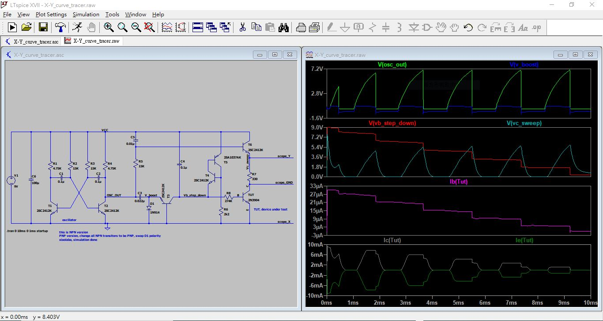

# LTspice_XY_curve_tracer  
transistor circuit, curve tracer uses oscope XY mode to visual sweeping VC and step down of Vb, LTspice simulation 

ref: https://www.eddybergman.com/2017/06/simple-but-effective-transistor-curve.html  

 

### the print
[X-Y_curve_tracer.pdf](X-Y_curve_tracer.pdf)  

### the source code
[X-Y_curve_tracer.asc](X-Y_curve_tracer.asc)  
```
Version 4
SHEET 1 1652 968
WIRE -288 -32 -432 -32
WIRE -144 -32 -288 -32
WIRE 0 -32 -144 -32
WIRE 128 -32 0 -32
WIRE 256 -32 128 -32
WIRE 480 -32 256 -32
WIRE 800 -32 480 -32
WIRE 1104 -32 800 -32
WIRE 1312 -32 1104 -32
WIRE 480 0 480 -32
WIRE 1312 32 1312 -32
WIRE 480 80 480 64
WIRE 1248 80 480 80
WIRE 1104 128 1104 -32
WIRE 480 160 480 80
WIRE 1312 160 1312 128
WIRE 1568 160 1312 160
WIRE 1632 160 1568 160
WIRE -144 176 -144 -32
WIRE 0 176 0 -32
WIRE 128 176 128 -32
WIRE 256 176 256 -32
WIRE 800 176 800 -32
WIRE 1040 176 1008 176
WIRE 1312 192 1312 160
WIRE 1008 256 1008 176
WIRE 1312 256 1312 192
WIRE -432 288 -432 -32
WIRE -288 288 -288 -32
WIRE -144 304 -144 256
WIRE -96 304 -144 304
WIRE 0 304 0 256
WIRE 0 304 -32 304
WIRE 128 304 128 256
WIRE 176 304 128 304
WIRE 256 304 256 256
WIRE 256 304 240 304
WIRE 1104 304 1104 224
WIRE 1104 304 1072 304
WIRE 1312 352 1312 336
WIRE 1568 352 1312 352
WIRE 1632 352 1568 352
WIRE 1312 368 1312 352
WIRE 1312 400 1312 368
WIRE 256 448 256 304
WIRE 320 448 256 448
WIRE 480 448 480 240
WIRE 480 448 320 448
WIRE 576 448 544 448
WIRE 592 448 576 448
WIRE 656 448 592 448
WIRE 800 448 800 240
WIRE 800 448 752 448
WIRE 912 448 800 448
WIRE 1008 448 1008 352
WIRE 1008 448 912 448
WIRE 1120 448 1008 448
WIRE 1232 448 1200 448
WIRE 1248 448 1232 448
WIRE -144 480 -144 304
WIRE 256 480 256 448
WIRE 576 496 576 448
WIRE 1104 512 1104 304
WIRE 0 528 128 304
WIRE 0 528 -80 528
WIRE 128 528 0 304
WIRE 192 528 128 528
WIRE 1312 544 1312 496
WIRE -432 640 -432 368
WIRE -288 640 -288 352
WIRE -288 640 -432 640
WIRE -144 640 -144 576
WIRE -144 640 -288 640
WIRE 256 640 256 576
WIRE 256 640 -144 640
WIRE 272 640 256 640
WIRE 576 640 576 560
WIRE 576 640 272 640
WIRE 704 640 704 512
WIRE 704 640 576 640
WIRE 1104 640 1104 592
WIRE 1104 640 704 640
WIRE 1312 640 1312 544
WIRE 1312 640 1104 640
WIRE 1568 640 1312 640
WIRE 1632 640 1568 640
WIRE 272 672 272 640
FLAG 272 672 0
FLAG 320 448 OSC_OUT
FLAG 256 -32 VCC
FLAG 1232 448 B
FLAG 1312 544 E
FLAG 1312 368 C
FLAG 1568 160 scope_Y
FLAG 1568 352 scope_GND
FLAG 1568 640 scope_X
FLAG 912 448 Vb_step_down
FLAG 592 448 V_boost
FLAG 1312 192 Vc_sweep
SYMBOL res -160 160 R0
SYMATTR InstName R1
SYMATTR Value 4.75K
SYMATTR SpiceLine tol=1 pwr=0.1
SYMBOL res -16 160 R0
SYMATTR InstName R2
SYMATTR Value 15K
SYMATTR SpiceLine tol=1 pwr=0.1
SYMBOL res 112 160 R0
SYMATTR InstName R3
SYMATTR Value 15K
SYMATTR SpiceLine tol=1 pwr=0.1
SYMBOL res 240 160 R0
SYMATTR InstName R4
SYMATTR Value 4.75K
SYMATTR SpiceLine tol=1 pwr=0.1
SYMBOL cap -32 288 R90
WINDOW 0 0 32 VBottom 2
WINDOW 3 32 32 VTop 2
SYMATTR InstName C1
SYMATTR Value 0.1?SYMATTR SpiceLine V=16 Irms=0 Rser=0 Lser=0 mfg="Murata" pn="GCM155R71C104KA55" type="X7R"
SYMBOL cap 240 288 R90
WINDOW 0 0 32 VBottom 2
WINDOW 3 32 32 VTop 2
SYMATTR InstName C2
SYMATTR Value 0.1?SYMATTR SpiceLine V=16 Irms=0 Rser=0 Lser=0 mfg="Murata" pn="GCM155R71C104KA55" type="X7R"
SYMBOL cap 496 64 R180
WINDOW 0 24 56 Left 2
WINDOW 3 24 8 Left 2
SYMATTR InstName C5
SYMATTR Value 0.01?SYMATTR SpiceLine V=4 Irms=162m Rser=0.395426 Lser=0
SYMBOL cap 544 432 R90
WINDOW 0 0 32 VBottom 2
WINDOW 3 32 32 VTop 2
SYMATTR InstName C3
SYMATTR Value 0.022?SYMATTR SpiceLine V=4 Irms=356m Rser=0.150334 Lser=0 mfg="KEMET" pn="C0402C223K7PAC" type="X5R"
SYMBOL res 464 144 R0
SYMATTR InstName R5
SYMATTR Value 15K
SYMATTR SpiceLine tol=1 pwr=0.1
SYMBOL diode 560 496 R0
SYMATTR InstName D1
SYMATTR Value 1N914
SYMBOL npn 752 512 M270
SYMATTR InstName T3
SYMATTR Value 2SC2412K
SYMBOL npn 1072 256 M0
SYMATTR InstName T4
SYMATTR Value 2SC2412K
SYMBOL npn 1248 32 R0
SYMATTR InstName T6
SYMATTR Value 2SC2412K
SYMBOL npn 1248 400 R0
SYMATTR InstName TUT
SYMATTR Value 2N3904
SYMBOL pnp 1040 224 M180
SYMATTR InstName T5
SYMATTR Value 2SA1037AK
SYMBOL npn 192 480 R0
SYMATTR InstName T2
SYMATTR Value 2SC2412K
SYMBOL npn -80 480 M0
SYMATTR InstName T1
SYMATTR Value 2SC2412K
SYMBOL cap 784 176 R0
SYMATTR InstName C4
SYMATTR Value 0.1?SYMATTR SpiceLine V=4 Irms=0 Rser=0 Lser=0 mfg="Murata" pn="GRM011R60G103KE01" type="X5R"
SYMBOL res 1216 432 R90
WINDOW 0 0 56 VBottom 2
WINDOW 3 32 56 VTop 2
SYMATTR InstName R8
SYMATTR Value 274K
SYMATTR SpiceLine tol=1 pwr=0.1
SYMBOL cap -304 288 R0
WINDOW 3 24 57 Left 2
SYMATTR InstName C6
SYMATTR Value 100?SYMATTR Description Polarized Capacitor
SYMATTR Type polcap
SYMATTR SpiceLine V=10 Irms=0 Rser=0 Lser=0 mfg="Murata" pn="GRM31CR61A107ME05" type="X5R"
SYMBOL voltage -432 272 R0
WINDOW 123 0 0 Left 0
WINDOW 39 0 0 Left 0
SYMATTR InstName V1
SYMATTR Value 9V
SYMBOL res 1296 240 R0
SYMATTR InstName R7
SYMATTR Value 330
SYMATTR SpiceLine tol=1 pwr=0.1
SYMBOL res 1088 496 R0
SYMATTR InstName R6
SYMATTR Value 2k2
TEXT -56 616 Left 2 ;oscillator
TEXT -466 696 Left 2 !.tran 0 10ms 0 1ms startup
TEXT -80 704 Left 2 ;this is NPN version\nPNP version, change all NPN transitors to be PNP, swap D1 polarity\nxiaolaba, simulation done
TEXT 1344 536 Left 2 ;TUT, device under test

```

